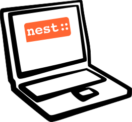

<h1 align="center">
  
   
  NEST Desktop
</h1>

NEST Desktop is a web-based application which provides a graphical user interface for [NEST Simulator](https://nest-simulator.org){:target="_blank"}. With this easy-to-use tool, users can interactively construct neuronal networks and explore network dynamics.

For more information, please read [the user documentation](http://nest-desktop.readthedocs.io){:target="_blank"}.

### Live demo of the application

We provide a [live demo](https://nest-desktop.github.io/app){:target="_blank"} of current NEST Desktop
but without the backend for the simulation.
To experience the app in full operation you can set the URL of the NEST Server.

### Badges

| | |
| - | - |
| General |    |
| GitHub |     |
| Docker |    |
| Python |   |
| Conda |   |
| AppImage |  
| Snap |   |

### App archives

The data structure of older application might not compatible with the current one.
Please first delete cookies of the browser before you start an older app.

- [v3.1.4](https://nest-desktop.github.io/archives/v3.1.4/){:target="_blank"}
- [v3.0.3](https://nest-desktop.github.io/archives/v3.0.3/){:target="_blank"}
- [v2.5.1](https://nest-desktop.github.io/archives/v2.5.1/){:target="_blank"}
- [v2.4.1](https://nest-desktop.github.io/archives/v2.4.1/){:target="_blank"}
- [v2.3.2](https://nest-desktop.github.io/archives/v2.3.2/){:target="_blank"}
- [v2.2.15](https://nest-desktop.github.io/archives/v2.2.15/){:target="_blank"}
- [v2.1.3](https://nest-desktop.github.io/archives/v2.1.3/){:target="_blank"}
- [v2.0.7](https://nest-desktop.github.io/archives/v2.0.7/){:target="_blank"}

### License [MIT](LICENSE)
